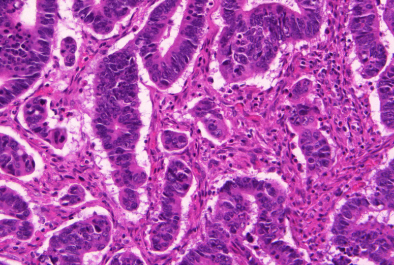
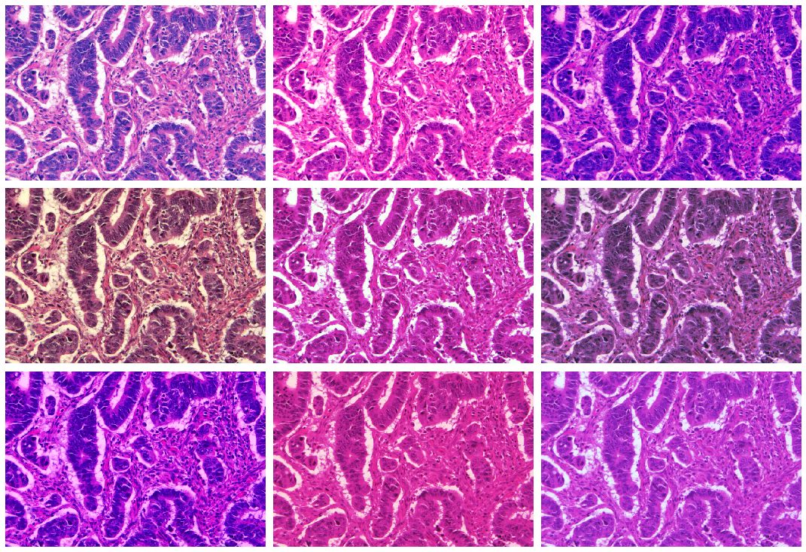

# Non-linear color augmentations
We often use linear color transformation (like most implementations of contrast, brightness jitter). These transformations are potentially quickly learned by a neural network, especially networks with normalization layers. This repository implements non-linear color augmentations (like gamma-correction and the S-curves in Photoshop).

**This repository is a PyTorch implementation of https://github.com/deepmind/multidim-image-augmentation**

## Example (see [notebook](Demo.ipynb))

### Original


Image taken from [GlaS dataset](https://warwick.ac.uk/fac/sci/dcs/research/tia/glascontest/).

### Color augmentations:



## Usage

```python
from coloraug import NonLinearColorJitter
transform = NonLinearColorJitter()
augmented_image = transform(image)
```

Or inside a **torchvision.transform**:
```python
transforms.Compose([
        transforms.CenterCrop(10),
        NonLinearColorJitter(),
        transforms.ToTensor(),
    ])
```
